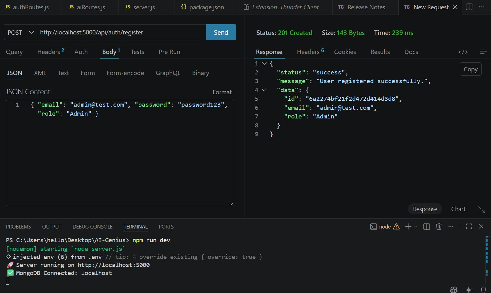
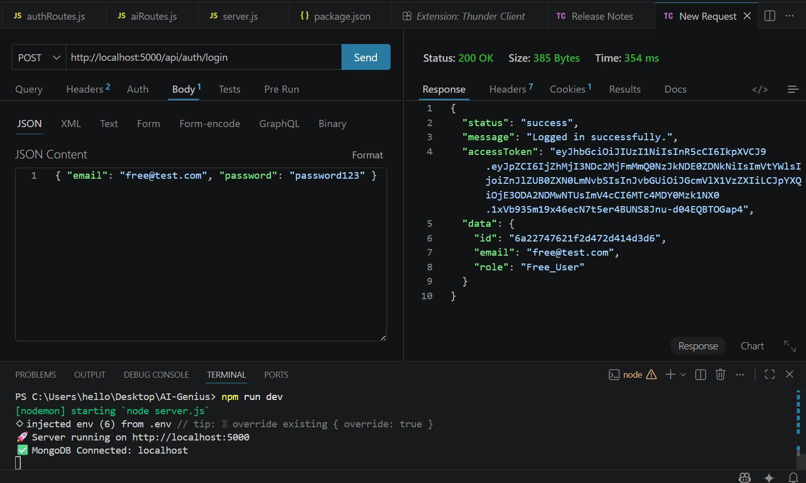
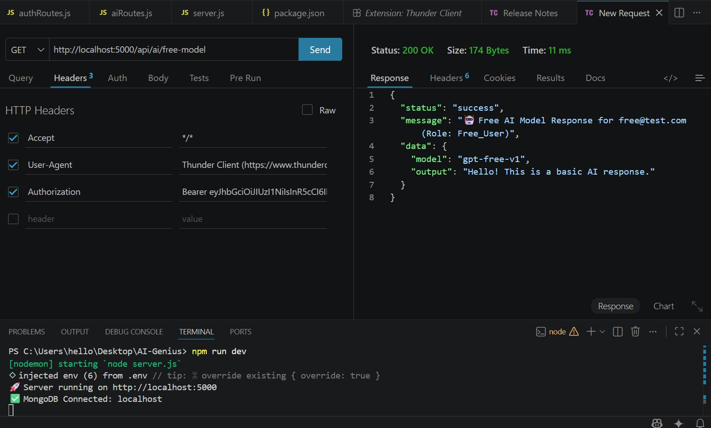
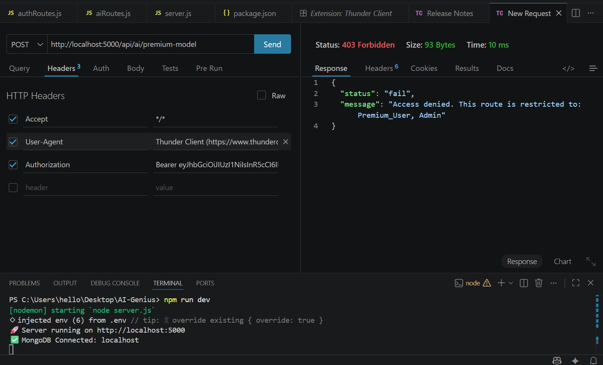
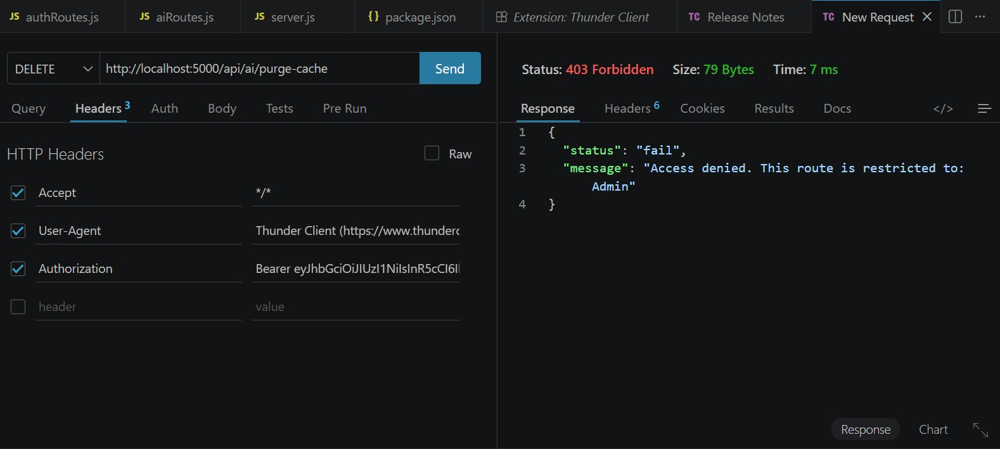

# 🤖 AI-Genius — JWT Authentication & Role-Based Access Control

---

## 👤 Student Information

| Field | Details |
|---|---|
| **Name** | Noor Rehman |
| **Registration ID** | 232579 |
| **Email** | 232579@students.au.edu.pk |
| **Alt Email** | hello.noorrehman@gmail.com |
| **Class** | BSDS-VI-A |
| **Course** | Web Technologies |
| **Assignment** | Assignment 03 |
| **Institution** | Air University, Islamabad |
| **Department** | Department of Creative Technologies |

---

## 📌 Project Overview

AI-Genius is a secure, stateless authentication and authorization backend built for a SaaS platform that serves premium AI text and image generation models. Since these AI models are expensive to run, the backend strictly enforces authentication, token expiration, and role-based access to make sure only the right users can reach the right endpoints.

The system is built on Node.js and Express, uses JSON Web Tokens for stateless auth, bcrypt for password hashing, MongoDB for data persistence, and httpOnly cookies for secure refresh token storage.

---

## 🏗️ File Structure

```
AI-Genius/
├── src/
│   ├── config/
│   │   └── db.js                  # MongoDB connection
│   ├── controllers/
│   │   ├── authController.js      # Register, Login, Refresh, Logout
│   │   └── aiController.js        # Mock AI endpoint handlers
│   ├── middleware/
│   │   ├── authMiddleware.js      # JWT verification middleware (protect)
│   │   └── rbacMiddleware.js      # Role-based access factory (restrictTo)
│   ├── models/
│   │   └── User.js                # Mongoose schema with bcrypt pre-save hook
│   └── routes/
│       ├── authRoutes.js          # /api/auth/* routes
│       └── aiRoutes.js            # /api/ai/* routes
├── .env                           # Environment secrets (gitignored)
├── .env.example                   # Template for env variables
├── .gitignore
├── package.json
└── server.js                      # App entry point
```

---

## ⚙️ Tech Stack

| Technology | Purpose |
|---|---|
| Node.js | Runtime environment |
| Express.js | Web server framework |
| MongoDB + Mongoose | Database and ODM |
| bcryptjs | Password hashing with salt rounds |
| jsonwebtoken | JWT creation and verification |
| cookie-parser | Reading httpOnly cookies |
| dotenv | Managing environment variables |
| nodemon | Auto-restart during development |

---

## 🔐 Security Design

### Dual Token Strategy

When a user logs in, two tokens are issued:

- **Access Token** — Short-lived (15 minutes). Sent in the JSON response body. The client stores it in memory and attaches it to every request via the `Authorization: Bearer` header.
- **Refresh Token** — Long-lived (7 days). Sent as an `httpOnly`, `secure`, `sameSite=strict` cookie. JavaScript running in the browser cannot read this cookie, which protects it from XSS attacks.

When the access token expires, the client silently calls `POST /api/auth/refresh`. The server reads the refresh token from the cookie, verifies it against the database whitelist, and issues a brand new access token — the user never has to log in again.

### Password Security

Every password is hashed using bcrypt with 12 salt rounds before being stored. The raw password never touches the database. Because bcrypt adds a random salt, two users with the same password will have completely different hashes, which defeats rainbow table attacks. The `password` field is also excluded from all Mongoose queries by default using `select: false`.

### Refresh Token Whitelist

Each refresh token is saved to the user's document in MongoDB. On logout, it's cleared from the database. On every refresh request, the server checks that the token in the cookie matches what's stored — this means stolen refresh tokens can be invalidated instantly by logging out.

---

## 🚦 Role-Based Access Control

Three roles exist in the system: `Free_User`, `Premium_User`, and `Admin`. A middleware factory called `restrictTo(...roles)` wraps any route and checks `req.user.role` against the allowed list.

| Endpoint | Free_User | Premium_User | Admin |
|---|---|---|---|
| GET /api/ai/free-model | ✅ 200 | ✅ 200 | ✅ 200 |
| POST /api/ai/premium-model | ❌ 403 | ✅ 200 | ✅ 200 |
| DELETE /api/ai/purge-cache | ❌ 403 | ❌ 403 | ✅ 200 |

---

## 🛣️ API Reference

### Auth Endpoints

| Method | Endpoint | Description |
|---|---|---|
| POST | /api/auth/register | Create a new user account |
| POST | /api/auth/login | Login and receive tokens |
| POST | /api/auth/refresh | Get a new access token via cookie |
| POST | /api/auth/logout | Invalidate refresh token |

### AI Endpoints (all require login)

| Method | Endpoint | Allowed Roles |
|---|---|---|
| GET | /api/ai/free-model | All logged-in users |
| POST | /api/ai/premium-model | Premium_User, Admin |
| DELETE | /api/ai/purge-cache | Admin only |

---

## 🧪 Test Results

All tests were run using **Thunder Client** inside VS Code. The server was connected to a local MongoDB instance. Every endpoint was tested for both success and failure cases.

---

### Test 1 — Register Premium User

**POST** `http://localhost:5000/api/auth/register`

```json
{ "email": "premium@test.com", "password": "password123", "role": "Premium_User" }
```

**Result: 201 Created**


The server hashed the password via bcrypt before saving. The raw password is never stored.

---

### Test 2 — Register Admin

**POST** `http://localhost:5000/api/auth/register`

```json
{ "email": "admin@test.com", "password": "password123", "role": "Admin" }
```

**Result: 201 Created**



---

### Test 3 — Login as Free User

**POST** `http://localhost:5000/api/auth/login`

```json
{ "email": "free@test.com", "password": "password123" }
```

**Result: 200 OK**



The response contains the `accessToken` in the JSON body. The `refreshToken` is automatically set as an httpOnly cookie (visible under the Cookies tab — `Cookies: 1` shown in the header bar). The JWT payload contains `id`, `email`, and `role` — no password is included.

---

### Test 4 — Access Free Model (Authorized)

**GET** `http://localhost:5000/api/ai/free-model`
`Authorization: Bearer <access_token>`

**Result: 200 OK**



The `protect` middleware decoded the JWT, verified the signature using `JWT_SECRET`, and attached the user payload to `req.user`. The free model endpoint is accessible by all logged-in users regardless of role.

---

### Test 5 — Premium Model Blocked for Free User

**POST** `http://localhost:5000/api/ai/premium-model`
`Authorization: Bearer <free_user_token>`

**Result: 403 Forbidden**



The `restrictTo('Premium_User', 'Admin')` middleware checked `req.user.role` which was `Free_User` — not in the allowed list — so it correctly returned 403. This is RBAC working as designed.

---

### Test 6 — Purge Cache as Admin (Authorized)

**DELETE** `http://localhost:5000/api/ai/purge-cache`
`Authorization: Bearer <admin_token>`

**Result: 200 OK**


Only the Admin role can reach this endpoint. The response confirms the admin's email and includes a `purgedAt` timestamp, proving the token was correctly decoded and the role verified.

---

### Test 7 — Purge Cache Blocked for Free User

**DELETE** `http://localhost:5000/api/ai/purge-cache`
`Authorization: Bearer <free_user_token>`

**Result: 403 Forbidden**



Even the DELETE endpoint correctly rejects a non-Admin user. The error message tells exactly which role is required: `"This route is restricted to: Admin"`.

---

### Test 8 & 9 — Silent Token Refresh

**POST** `http://localhost:5000/api/auth/refresh`
(No body — the refresh token is read automatically from the httpOnly cookie)

**Result: 200 OK**


This is the silent refresh flow. The client sends no credentials — the browser (or Thunder Client) automatically attaches the `refreshToken` cookie. The server verifies it, checks the database whitelist, and issues a completely new access token. The old access token is now replaced.

---

### Test 10 — Logout

**POST** `http://localhost:5000/api/auth/logout`

**Result: 200 OK**


On logout, the server clears the `refreshToken` field in the database and removes the cookie. Calling `/refresh` after this returns `401 Unauthorized` because the token no longer exists in the whitelist — the session is fully destroyed.

---

## 🔄 Authentication Flow

```
Client                        Server                      MongoDB
  │                              │                            │
  ├─── POST /login ─────────────▶│                            │
  │    {email, password}         ├─── findOne({email}) ──────▶│
  │                              │◀── user document ──────────┤
  │                              ├─── bcrypt.compare()        │
  │                              ├─── sign AccessToken(15m)   │
  │                              ├─── sign RefreshToken(7d)   │
  │                              ├─── save refreshToken ─────▶│
  │◀── accessToken + cookie ─────┤                            │
  │                              │                            │
  ├─── GET /api/ai/free-model ──▶│                            │
  │    Bearer <accessToken>      ├─── jwt.verify(token)       │
  │                              ├─── attach req.user         │
  │◀── 200 OK ───────────────────┤                            │
  │                              │                            │
  │   [15 min later - expired]   │                            │
  │                              │                            │
  ├─── POST /auth/refresh ──────▶│                            │
  │    (cookie auto-sent)        ├─── jwt.verify(cookie)      │
  │                              ├─── check DB whitelist ────▶│
  │                              │◀── token matched ──────────┤
  │◀── new accessToken ──────────┤                            │
  │                              │                            │
  ├─── POST /auth/logout ───────▶│                            │
  │                              ├─── clear refreshToken ────▶│
  │                              ├─── clear cookie            │
  │◀── 200 Logged out ───────────┤                            │
```

---

## 🌍 Environment Variables

```env
PORT=5000
MONGO_URI=mongodb://localhost:27017/ai_genius
JWT_SECRET=your_super_secret_jwt_key_change_this_in_production
JWT_ACCESS_EXPIRES=15m
JWT_REFRESH_EXPIRES=7d
NODE_ENV=development
```

> Never commit the `.env` file. Use `.env.example` as a safe template to share the required keys without exposing actual secrets.

---

## 🚀 Running the Project

```bash
# Install dependencies
npm install

# Start in development mode
npm run dev

# Start in production
npm start
```

Expected output:
```
🚀 Server running on http://localhost:5000
✅ MongoDB Connected: localhost
```

---

## 📬 Contact

**Noor Rehman**
232579@students.au.edu.pk | hello.noorrehman@gmail.com
BSDS-VI-A | Air University, Islamabad