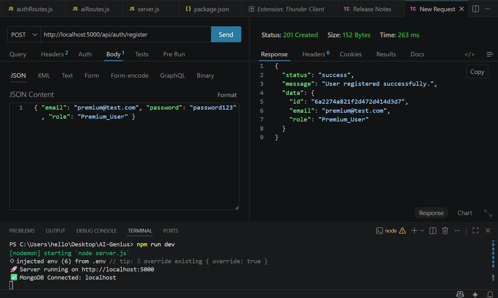
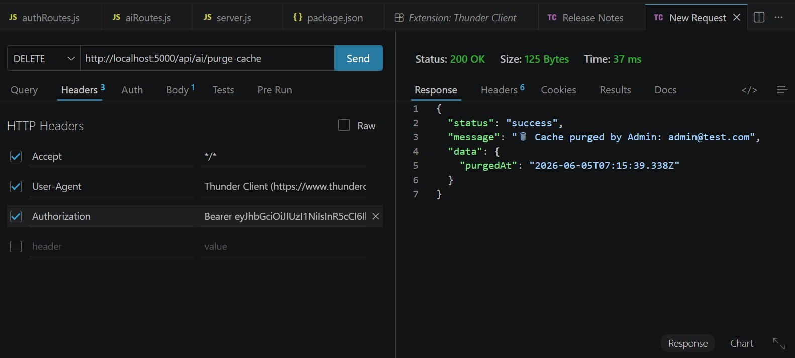
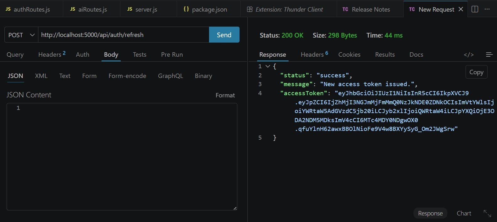
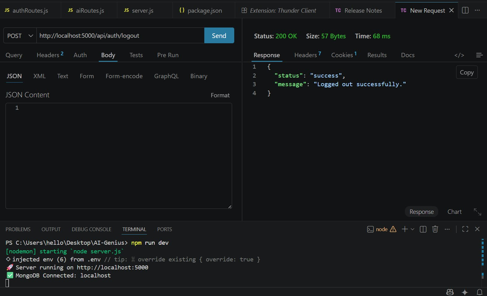

# AI-Genius: JWT Authentication and Role-Based Access Control

---

## Student Information

| Field | Details |
|---|---|
| **Name** | Noor Rehman |
| **Registration ID** | 232579 |
| **Email** | 232579@students.au.edu.pk |
| **Alt Email** | hello.noorrehman@gmail.com |
| **Class** | BSDS-VI-A |
| **Course** | Web Technologies |
| **Assignment** | Assignment 03 |
| **Institution** | Air University, Islamabad |
| **Department** | Department of Creative Technologies |

---

## What This Assignment Is About

This assignment required building a secure, stateless authentication and authorization backend for a SaaS platform called AI-Genius. The platform offers premium AI text and image generation models. Because those models cost money to run, the backend has to make sure only authenticated, properly-authorized users can hit the expensive endpoints.

The work covers four main tasks: setting up a user database with hashed passwords, implementing JWT-based login with dual tokens, building a token refresh flow, and enforcing role-based access control across three different API endpoints.

---

## File Structure

```
AI-Genius/
├── src/
│   ├── config/
│   │   └── db.js                  # MongoDB connection
│   ├── controllers/
│   │   ├── authController.js      # Register, Login, Refresh, Logout
│   │   └── aiController.js        # Mock AI endpoint handlers
│   ├── middleware/
│   │   ├── authMiddleware.js      # JWT verification (protect middleware)
│   │   └── rbacMiddleware.js      # Role access factory (restrictTo)
│   ├── models/
│   │   └── User.js                # Mongoose schema with bcrypt pre-save hook
│   └── routes/
│       ├── authRoutes.js          # /api/auth/* routes
│       └── aiRoutes.js            # /api/ai/* routes
├── .env                           # Environment secrets (not committed)
├── .env.example                   # Safe template showing required keys
├── .gitignore
├── package.json
└── server.js                      # App entry point
```

---

## Tech Stack

| Technology | Purpose |
|---|---|
| Node.js | Runtime |
| Express.js | Web server framework |
| MongoDB + Mongoose | Database and ODM |
| bcryptjs | Password hashing |
| jsonwebtoken | JWT creation and verification |
| cookie-parser | Reading httpOnly cookies |
| dotenv | Environment variable management |
| nodemon | Auto-restart in development |

---

## Task Breakdown

### Task 1: Database Setup and Login Endpoint

**File:** `src/models/User.js`, `src/controllers/authController.js`

The User model stores four fields: `_id` (MongoDB), `email`, `password`, and `role`. The role field accepts three values: `Admin`, `Premium_User`, and `Free_User`.

Passwords are never saved as plain text. A Mongoose `pre('save')` hook runs bcrypt with 12 salt rounds every time a user is created or their password changes. If the password field was not modified, the hook skips itself to avoid double-hashing.

The login endpoint at `POST /api/auth/login` checks the email, compares the entered password against the stored hash using `bcrypt.compare()`, then generates two tokens on success:

1. An **Access Token** that expires in 15 minutes. It goes in the JSON response body so the client can store it in memory and attach it to future requests.
2. A **Refresh Token** that expires in 7 days. It is sent as an `httpOnly`, `secure`, `sameSite=strict` cookie. The browser handles it automatically and JavaScript cannot read it, which blocks XSS-based token theft.

### Task 2: JWT Payload and Auth Middleware

**File:** `src/middleware/authMiddleware.js`

The JWT payload includes only three fields: `id`, `email`, and `role`. The password field is excluded completely, both in the token and in Mongoose queries (using `select: false` on the schema).

The `protect` middleware reads the `Authorization: Bearer <token>` header from every incoming request. It calls `jwt.verify()` with the `JWT_SECRET` from the environment file. If the token is valid, it attaches the decoded payload to `req.user` and passes control to the next handler. If the token is missing, malformed, or expired, it returns a clean JSON error with the right status code (401 for missing/expired, 401 for invalid signature).

### Task 3: Token Refresh Endpoint

**File:** `src/controllers/authController.js` (refresh function)

When the 15-minute access token expires, the client calls `POST /api/auth/refresh` with no body. The server reads the refresh token from the cookie automatically. It then:

1. Verifies the token signature using `JWT_SECRET`
2. Looks up the user in MongoDB
3. Checks that the token in the cookie matches what is saved in the database (whitelist check)
4. Issues a brand new access token

The whitelist step matters. It means that if a user logs out or if an admin wants to revoke access, clearing the stored token from the database is enough to block all future refreshes from that session.

### Task 4: Role-Based Access Control

**File:** `src/middleware/rbacMiddleware.js`, `src/routes/aiRoutes.js`

The `restrictTo(...roles)` function is a middleware factory. You call it with one or more role names and it returns a middleware function that checks `req.user.role` against that list. If the role is not in the list, it returns 403 with a message that says exactly which roles are allowed.

Three mock AI endpoints test the RBAC:

- `GET /api/ai/free-model` is open to all logged-in users
- `POST /api/ai/premium-model` is restricted to `Premium_User` and `Admin`
- `DELETE /api/ai/purge-cache` is restricted to `Admin` only

The route file chains `protect` first (checks authentication) and then `restrictTo` (checks authorization). If `protect` fails, `restrictTo` never runs.

---

## Security Guidelines Followed

**No plaintext passwords.** bcrypt with 12 rounds is applied before any user document is saved to MongoDB.

**Environment variables.** The JWT secret, token expiry times, and database URI are all in `.env` and loaded via dotenv. The `.env` file is in `.gitignore`. A `.env.example` file shows which keys are needed without exposing actual values.

**Centralized error handling.** The auth middleware catches `TokenExpiredError` and `JsonWebTokenError` separately and returns appropriate HTTP codes. The Express app also has a global error handler at the bottom of `server.js` as a fallback.

---

## Role Access Summary

| Endpoint | Free_User | Premium_User | Admin |
|---|---|---|---|
| GET /api/ai/free-model | 200 OK | 200 OK | 200 OK |
| POST /api/ai/premium-model | 403 Forbidden | 200 OK | 200 OK |
| DELETE /api/ai/purge-cache | 403 Forbidden | 403 Forbidden | 200 OK |

---

## API Reference

### Auth Routes

| Method | Endpoint | Description |
|---|---|---|
| POST | /api/auth/register | Create a new user |
| POST | /api/auth/login | Login and get tokens |
| POST | /api/auth/refresh | Get new access token from cookie |
| POST | /api/auth/logout | Clear refresh token |

### AI Routes (login required)

| Method | Endpoint | Who Can Access |
|---|---|---|
| GET | /api/ai/free-model | Any logged-in user |
| POST | /api/ai/premium-model | Premium_User, Admin |
| DELETE | /api/ai/purge-cache | Admin only |

---

## Test Results

All tests were done with Thunder Client in VS Code. The server ran locally with MongoDB on port 27017.

---

### Test 1: Register Premium User

**POST** `http://localhost:5000/api/auth/register`

```json
{ "email": "premium@test.com", "password": "password123", "role": "Premium_User" }
```

**Status: 201 Created**



The password was hashed by bcrypt before MongoDB stored the document. The response only returns `id`, `email`, and `role`.

---

### Test 2: Register Admin

**POST** `http://localhost:5000/api/auth/register`

```json
{ "email": "admin@test.com", "password": "password123", "role": "Admin" }
```

**Status: 201 Created**


---

### Test 3: Login as Free User

**POST** `http://localhost:5000/api/auth/login`

```json
{ "email": "free@test.com", "password": "password123" }
```

**Status: 200 OK**


The response body contains the `accessToken`. The `refreshToken` was set as an httpOnly cookie (Thunder Client shows `Cookies: 1` in the response header tab). The JWT payload has `id`, `email`, and `role`. No password is anywhere in the response.

---

### Test 4: Free Model Access (All Users)

**GET** `http://localhost:5000/api/ai/free-model`

Header: `Authorization: Bearer <access_token>`

**Status: 200 OK**


The `protect` middleware decoded the token, verified it against `JWT_SECRET`, and attached the user payload to `req.user`. The endpoint returned the user's email and role in the response message, confirming the decode worked correctly.

---

### Test 5: Premium Model Blocked for Free User

**POST** `http://localhost:5000/api/ai/premium-model`

Header: `Authorization: Bearer <free_user_token>`

**Status: 403 Forbidden**


`restrictTo('Premium_User', 'Admin')` checked `req.user.role`, found `Free_User`, and returned 403. The RBAC layer is working correctly.

---

### Test 6: Purge Cache as Admin

**DELETE** `http://localhost:5000/api/ai/purge-cache`

Header: `Authorization: Bearer <admin_token>`

**Status: 200 OK**



The admin token was decoded and `req.user.role` was `Admin`, which passed the `restrictTo('Admin')` check. The response includes the admin's email and a `purgedAt` timestamp.

---

### Test 7: Purge Cache Blocked for Free User

**DELETE** `http://localhost:5000/api/ai/purge-cache`

Header: `Authorization: Bearer <free_user_token>`

**Status: 403 Forbidden**


Free users cannot reach Admin-only routes. The error message says exactly which role is required: `"This route is restricted to: Admin"`.

---

### Test 8 and 9: Silent Token Refresh

**POST** `http://localhost:5000/api/auth/refresh`

No body needed. The refresh token is sent automatically from the cookie.

**Status: 200 OK**




The server read the cookie, verified the token, matched it against the database whitelist, and returned a new access token. The client can use this to keep the session going without making the user log in again.

---

### Test 10: Logout

**POST** `http://localhost:5000/api/auth/logout`

**Status: 200 OK**



The server cleared the `refreshToken` field from the user's MongoDB document and removed the cookie. After this, calling `/refresh` returns 401 because the token is no longer in the whitelist.

---

## Authentication Flow

```
Client                        Server                      MongoDB
  |                              |                            |
  |--- POST /login ------------->|                            |
  |    {email, password}         |--- findOne({email}) ------>|
  |                              |<-- user document ----------|
  |                              |--- bcrypt.compare()        |
  |                              |--- sign AccessToken(15m)   |
  |                              |--- sign RefreshToken(7d)   |
  |                              |--- save refreshToken ----->|
  |<-- accessToken + cookie -----|                            |
  |                              |                            |
  |--- GET /api/ai/free-model -->|                            |
  |    Bearer <accessToken>      |--- jwt.verify(token)       |
  |                              |--- attach req.user         |
  |<-- 200 OK -------------------|                            |
  |                              |                            |
  |   [token expires at 15 min]  |                            |
  |                              |                            |
  |--- POST /auth/refresh ------>|                            |
  |    (cookie sent by browser)  |--- jwt.verify(cookie)      |
  |                              |--- check whitelist ------->|
  |                              |<-- match found ------------|
  |<-- new accessToken ----------|                            |
  |                              |                            |
  |--- POST /auth/logout ------->|                            |
  |                              |--- clear refreshToken ---->|
  |                              |--- clear cookie            |
  |<-- 200 Logged out -----------|                            |
```

---

## Environment Variables

```env
PORT=5000
MONGO_URI=mongodb://localhost:27017/ai_genius
JWT_SECRET=your_super_secret_jwt_key_change_this_in_production
JWT_ACCESS_EXPIRES=15m
JWT_REFRESH_EXPIRES=7d
NODE_ENV=development
```

The `.env` file is not committed to Git. The `.env.example` file shows which keys are required so anyone cloning the repo knows what to set up.

---

## Running the Assignment

```bash
# Install all packages
npm install

# Run in development mode
npm run dev
```

Expected terminal output:
```
Server running on http://localhost:5000
MongoDB Connected: localhost
```

---

## Contact

**Noor Rehman**
232579@students.au.edu.pk | hello.noorrehman@gmail.com
BSDS-VI-A | Air University, Islamabad