# AI-Genius: JWT Authentication and Role-Based Access Control

---

## Student Information

| Field | Details |
|---|---|
| **Name** | Noor Rehman |
| **Registration ID** | 232579 |
| **Email** | 232579@students.au.edu.pk |
| **Alt Email** | hello.noorrehman@gmail.com |
| **Class** | BSDS-VI-A |
| **Course** | Web Technologies |
| **Assignment** | Assignment 03 |
| **Institution** | Air University, Islamabad |
| **Department** | Department of Creative Technologies |

---

## What This Assignment Is About

This assignment required building a secure, stateless authentication and authorization backend for a SaaS platform called AI-Genius. The platform offers premium AI text and image generation models. Because those models cost money to run, the backend has to make sure only authenticated and properly authorized users can hit the expensive endpoints.

The work covers four main tasks: setting up a user database with hashed passwords, implementing JWT-based login with dual tokens, building a token refresh flow, and enforcing role-based access control across three different API endpoints.

---

## File Structure

```
AI-Genius/
├── src/
│   ├── config/
│   │   └── db.js                  # MongoDB connection
│   ├── controllers/
│   │   ├── authController.js      # Register, Login, Refresh, Logout
│   │   └── aiController.js        # Mock AI endpoint handlers
│   ├── middleware/
│   │   ├── authMiddleware.js      # JWT verification (protect middleware)
│   │   └── rbacMiddleware.js      # Role access factory (restrictTo)
│   ├── models/
│   │   └── User.js                # Mongoose schema with bcrypt pre-save hook
│   └── routes/
│       ├── authRoutes.js          # /api/auth/* routes
│       └── aiRoutes.js            # /api/ai/* routes
├── .env                           # Environment secrets (not committed)
├── .env.example                   # Safe template showing required keys
├── .gitignore
├── package.json
├── postman-collection.json        # Postman collection for full workflow
└── server.js                      # App entry point
```

---

## Tech Stack

| Technology | Purpose |
|---|---|
| Node.js | Runtime |
| Express.js | Web server framework |
| MongoDB + Mongoose | Database and ODM |
| bcryptjs | Password hashing |
| jsonwebtoken | JWT creation and verification |
| cookie-parser | Reading httpOnly cookies |
| dotenv | Environment variable management |
| nodemon | Auto-restart in development |

---

## Task Breakdown

### Task 1: Database Setup and Login Endpoint

**Files:** `src/models/User.js`, `src/controllers/authController.js`

The User model stores four fields: `_id` (MongoDB auto-generated), `email`, `password`, and `role`. The role field accepts three values: `Admin`, `Premium_User`, and `Free_User`.

Passwords are never saved as plain text. A Mongoose `pre('save')` hook runs bcrypt with 12 salt rounds every time a user is created or their password changes. If the password field was not modified, the hook skips itself to avoid double-hashing.

The login endpoint at `POST /api/auth/login` checks the email, compares the entered password against the stored hash using `bcrypt.compare()`, then generates two tokens on success:

1. An **Access Token** that expires in 15 minutes. It goes in the JSON response body so the client can store it in memory and attach it to future requests.
2. A **Refresh Token** that expires in 7 days. It is sent as an `httpOnly`, `secure`, `sameSite=strict` cookie. JavaScript in the browser cannot read this cookie, which blocks XSS-based token theft.

### Task 2: JWT Payload and Auth Middleware

**File:** `src/middleware/authMiddleware.js`

The JWT payload includes only three fields: `id`, `email`, and `role`. The password field is excluded completely, both from the token and from Mongoose queries using `select: false` on the schema.

The `protect` middleware reads the `Authorization: Bearer <token>` header from every incoming request. It calls `jwt.verify()` with the `JWT_SECRET` from the environment file. If the token is valid, it attaches the decoded payload to `req.user` and passes control to the next handler. If the token is missing, malformed, or expired, it returns a clean JSON error with the correct HTTP status code.

### Task 3: Token Refresh Endpoint

**File:** `src/controllers/authController.js` (refresh function)

When the 15-minute access token expires, the client calls `POST /api/auth/refresh` with no body. The server reads the refresh token from the cookie automatically. It then verifies the token signature, looks up the user in MongoDB, checks that the cookie token matches what is stored in the database (whitelist check), and issues a brand new access token.

The whitelist step is important. If a user logs out or an admin wants to revoke access, clearing the stored token from the database is enough to block all future refreshes from that session.

### Task 4: Role-Based Access Control

**Files:** `src/middleware/rbacMiddleware.js`, `src/routes/aiRoutes.js`

The `restrictTo(...roles)` function is a middleware factory. You call it with one or more role names and it returns a middleware function that checks `req.user.role` against that list. If the role is not in the list, it returns 403 with a message that says exactly which roles are allowed.

Three mock AI endpoints test the RBAC layer:

- `GET /api/ai/free-model` is open to all logged-in users
- `POST /api/ai/premium-model` is restricted to `Premium_User` and `Admin`
- `DELETE /api/ai/purge-cache` is restricted to `Admin` only

The route file chains `protect` first to check authentication, then `restrictTo` to check authorization. If `protect` fails, `restrictTo` never runs.

---

## Security Guidelines Followed

**No plaintext passwords.** bcrypt with 12 rounds is applied before any user document is saved to MongoDB.

**Environment variables.** The JWT secret, token expiry times, and database URI are all in `.env` and loaded via dotenv. The `.env` file is in `.gitignore`. A `.env.example` file shows which keys are needed without exposing actual values.

**Centralized error handling.** The auth middleware catches `TokenExpiredError` and `JsonWebTokenError` separately and returns appropriate HTTP status codes. The Express app also has a global error handler at the bottom of `server.js` as a fallback.

---

## Role Access Summary

| Endpoint | Free_User | Premium_User | Admin |
|---|---|---|---|
| GET /api/ai/free-model | 200 OK | 200 OK | 200 OK |
| POST /api/ai/premium-model | 403 Forbidden | 200 OK | 200 OK |
| DELETE /api/ai/purge-cache | 403 Forbidden | 403 Forbidden | 200 OK |

---

## API Reference

### Auth Routes

| Method | Endpoint | Description |
|---|---|---|
| POST | /api/auth/register | Create a new user |
| POST | /api/auth/login | Login and get tokens |
| POST | /api/auth/refresh | Get new access token from cookie |
| POST | /api/auth/logout | Clear refresh token |

### AI Routes (login required)

| Method | Endpoint | Who Can Access |
|---|---|---|
| GET | /api/ai/free-model | Any logged-in user |
| POST | /api/ai/premium-model | Premium_User, Admin |
| DELETE | /api/ai/purge-cache | Admin only |

---

## Test Results

All tests were run using **Postman** with the Desktop Agent connected to the local server. The environment variables `accessToken`, `premiumToken`, and `adminToken` were stored in a Postman environment called `AI-Genius Env` so all requests using `{{accessToken}}`, `{{premiumToken}}`, and `{{adminToken}}` resolved automatically.

---

### Test 1: Register Free User

**POST** `http://localhost:5000/api/auth/register`

```json
{ "email": "free@test.com", "password": "password123", "role": "Free_User" }
```

**Status: 201 Created**

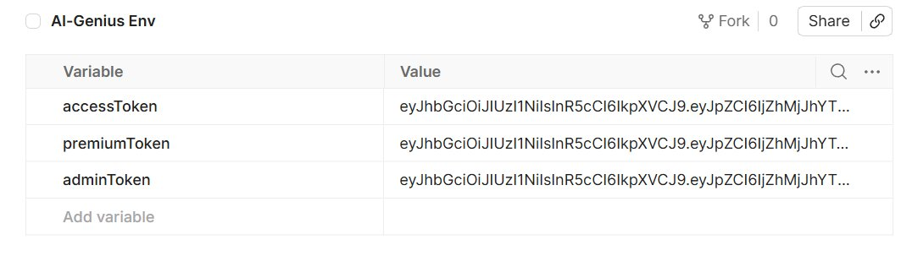

The password was hashed by bcrypt before MongoDB stored the document. The response only returns `id`, `email`, and `role`.

### MongoDB Users Collection Snapshot

The MongoDB Compass view below shows the `users` collection after registration. It confirms that passwords are stored as bcrypt hashes instead of plain text, while the `role` and `refreshToken` fields are saved alongside the user record.

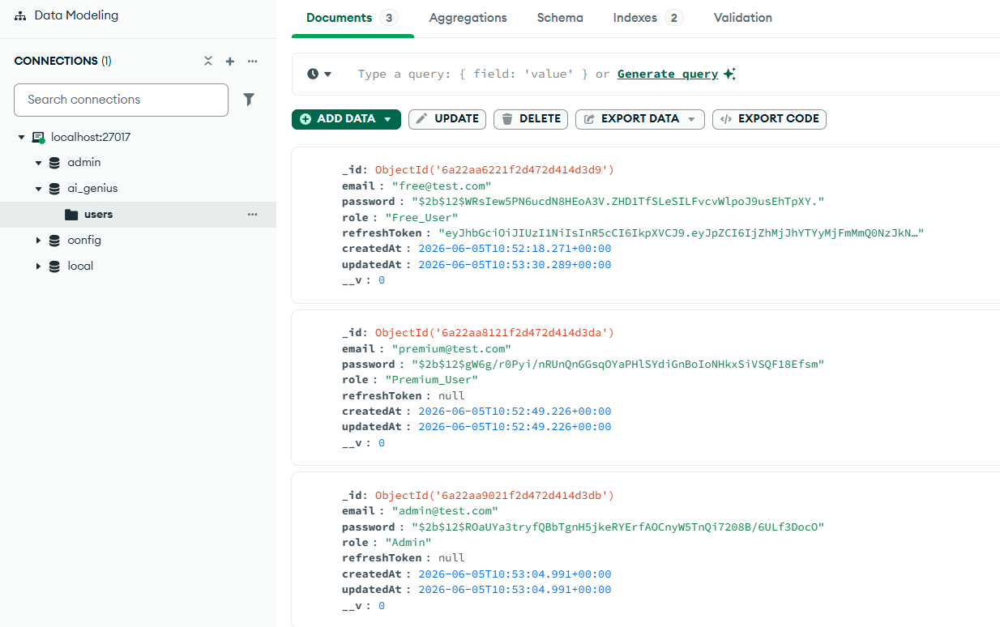

---

### Test 2: Register Premium User

**POST** `http://localhost:5000/api/auth/register`

```json
{ "email": "premium@test.com", "password": "password123", "role": "Premium_User" }
```

**Status: 201 Created**

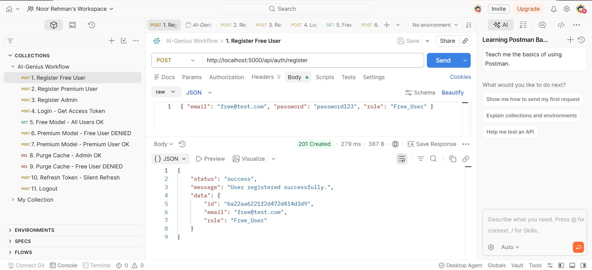

---

### Test 3: Register Admin

**POST** `http://localhost:5000/api/auth/register`

```json
{ "email": "admin@test.com", "password": "password123", "role": "Admin" }
```

**Status: 201 Created**

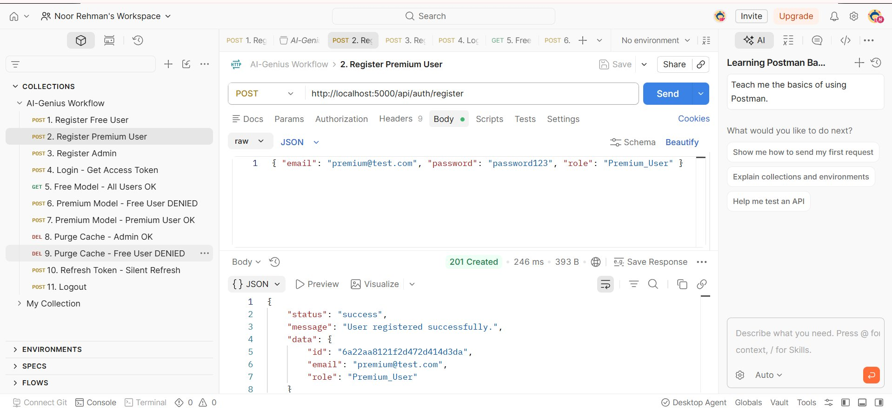

---

### Test 4: Login and Get Access Token

**POST** `http://localhost:5000/api/auth/login`

```json
{ "email": "free@test.com", "password": "password123" }
```

**Status: 200 OK**

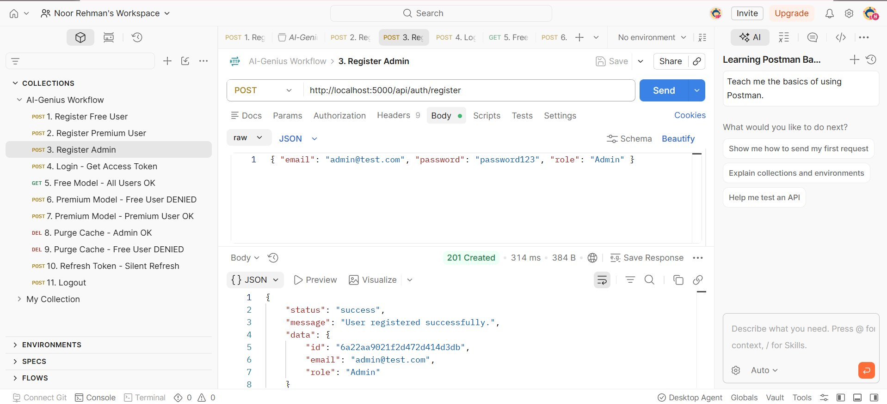

The response body contains the `accessToken`. The `refreshToken` is set as an httpOnly cookie automatically. The JWT payload carries `id`, `email`, and `role` with no password anywhere in the response. The tokens for all three users were saved into the Postman environment as `accessToken`, `premiumToken`, and `adminToken`.

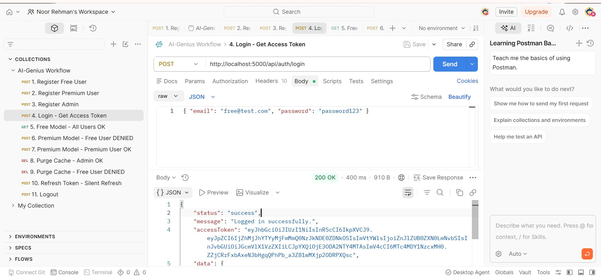

---

### Test 5: Free Model Access (All Users Authorized)

**GET** `http://localhost:5000/api/ai/free-model`

Header: `Authorization: Bearer {{accessToken}}`

**Status: 200 OK**

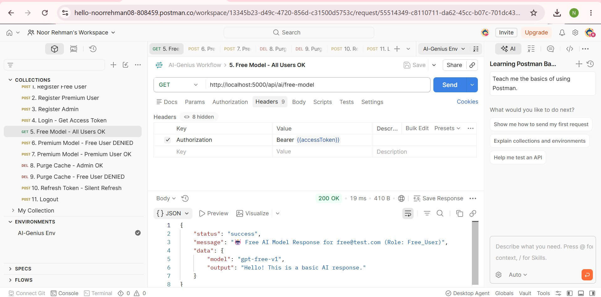

The `protect` middleware decoded the JWT, verified the signature using `JWT_SECRET`, and attached the user payload to `req.user`. The response confirms the user's email and role, proving the token decoded correctly.

---

### Test 6: Premium Model Blocked for Free User

**POST** `http://localhost:5000/api/ai/premium-model`

Header: `Authorization: Bearer {{accessToken}}`

**Status: 403 Forbidden**

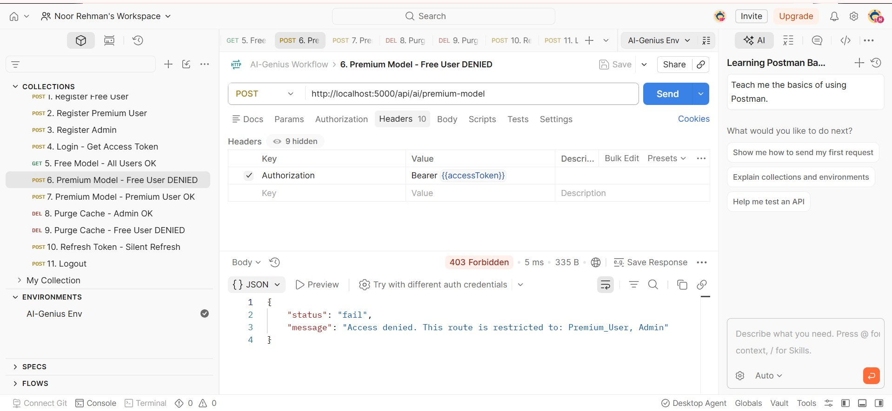

`restrictTo('Premium_User', 'Admin')` checked `req.user.role`, found `Free_User`, and returned 403. The error message clearly states which roles are allowed.

---

### Test 7: Premium Model Allowed for Premium User

**POST** `http://localhost:5000/api/ai/premium-model`

Header: `Authorization: Bearer {{premiumToken}}`

**Status: 200 OK**

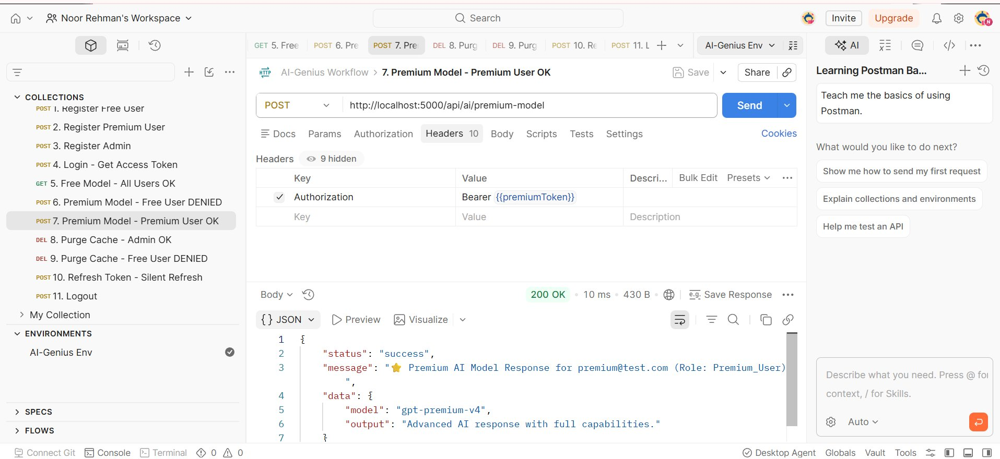

The Premium_User token passed the `restrictTo` check. The response confirms the premium model was served with the correct user email and role in the message.

---

### Test 8: Purge Cache as Admin

**DELETE** `http://localhost:5000/api/ai/purge-cache`

Header: `Authorization: Bearer {{adminToken}}`

**Status: 200 OK**

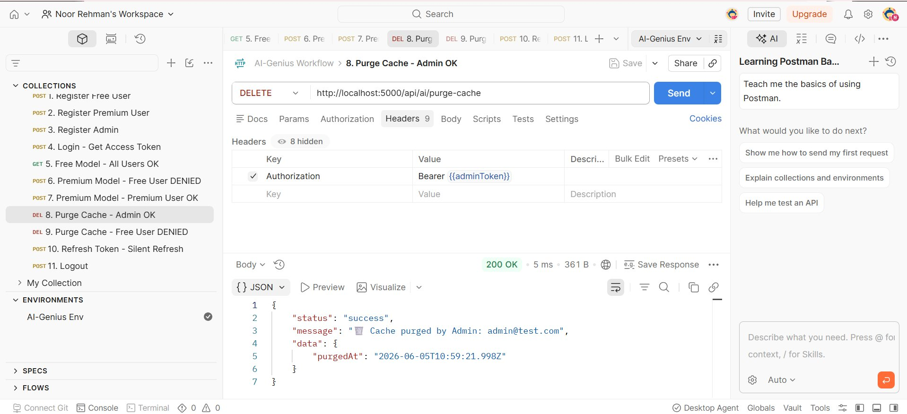

Only the Admin role can reach this endpoint. The response confirms the admin's email and includes a `purgedAt` timestamp, proving the token was decoded and the role verified correctly.

---

### Test 9: Purge Cache Blocked for Free User

**DELETE** `http://localhost:5000/api/ai/purge-cache`

Header: `Authorization: Bearer {{accessToken}}`

**Status: 403 Forbidden**

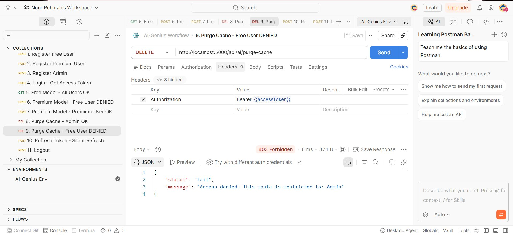

The Admin-only route correctly rejected the Free_User. The error message says exactly which role is required: `"This route is restricted to: Admin"`.

---

### Test 10: Silent Token Refresh

**POST** `http://localhost:5000/api/auth/refresh`

No body needed. The refresh token is read automatically from the httpOnly cookie.

**Status: 200 OK**

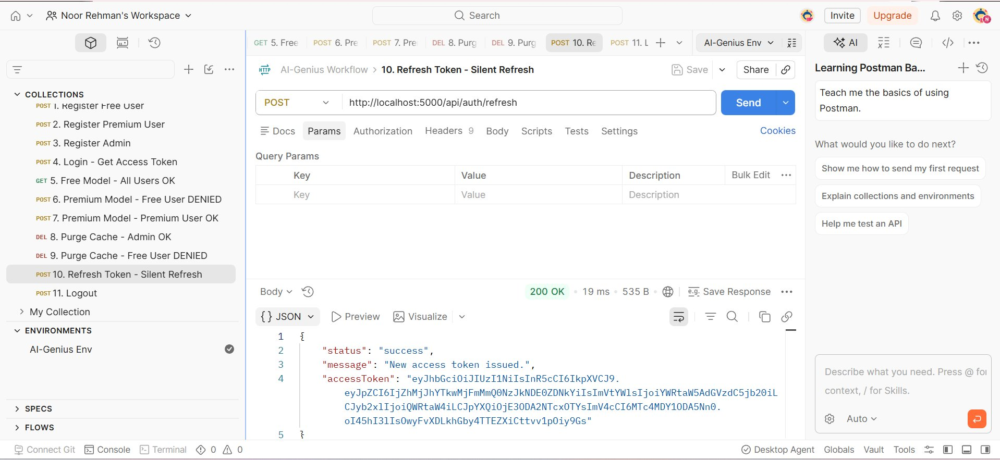

The server read the cookie, verified the token signature, matched it against the database whitelist, and returned a brand new access token. This is the silent refresh flow where the user never has to log in again as long as the refresh token is valid.

---

### Test 11: Logout

**POST** `http://localhost:5000/api/auth/logout`

**Status: 200 OK**

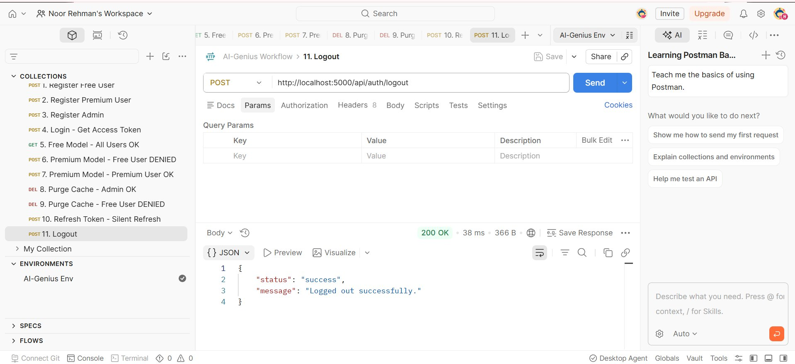

The server cleared the `refreshToken` field from the user's MongoDB document and removed the cookie. Calling `/refresh` after this returns 401 because the token no longer exists in the whitelist, meaning the session is fully destroyed.

---

## Authentication Flow

```
Client                        Server                      MongoDB
  |                              |                            |
  |--- POST /login ------------->|                            |
  |    {email, password}         |--- findOne({email}) ------>|
  |                              |<-- user document ----------|
  |                              |--- bcrypt.compare()        |
  |                              |--- sign AccessToken(15m)   |
  |                              |--- sign RefreshToken(7d)   |
  |                              |--- save refreshToken ----->|
  |<-- accessToken + cookie -----|                            |
  |                              |                            |
  |--- GET /api/ai/free-model -->|                            |
  |    Bearer <accessToken>      |--- jwt.verify(token)       |
  |                              |--- attach req.user         |
  |<-- 200 OK -------------------|                            |
  |                              |                            |
  |   [token expires at 15 min]  |                            |
  |                              |                            |
  |--- POST /auth/refresh ------>|                            |
  |    (cookie sent by browser)  |--- jwt.verify(cookie)      |
  |                              |--- check whitelist ------->|
  |                              |<-- match found ------------|
  |<-- new accessToken ----------|                            |
  |                              |                            |
  |--- POST /auth/logout ------->|                            |
  |                              |--- clear refreshToken ---->|
  |                              |--- clear cookie            |
  |<-- 200 Logged out -----------|                            |
```

---

## Environment Variables

```env
PORT=5000
MONGO_URI=mongodb://localhost:27017/ai_genius
JWT_SECRET=your_super_secret_jwt_key_change_this_in_production
JWT_ACCESS_EXPIRES=15m
JWT_REFRESH_EXPIRES=7d
NODE_ENV=development
```

The `.env` file is not committed to Git. The `.env.example` file shows which keys are required so anyone cloning the repo knows what to set up.

---

## Running the Assignment

```bash
# Install all packages
npm install

# Run in development mode
npm run dev
```

Expected terminal output:
```
Server running on http://localhost:5000
MongoDB Connected: localhost
```

---

## Postman Collection

A Postman collection file `postman-collection.json` is included in the repository. It contains all 11 requests demonstrating the complete workflow:

**Login > Access Protected API > Token Expires > Refresh Token > Access Denied on Unauthorized Roles**

To use it:
1. Open Postman
2. Click **Import**
3. Select `postman-collection.json`
4. Create an environment with `accessToken`, `premiumToken`, and `adminToken` variables
5. Run requests in order from 1 to 11

---

## Contact

**Noor Rehman**
232579@students.au.edu.pk | hello.noorrehman@gmail.com
BSDS-VI-A | Air University, Islamabad